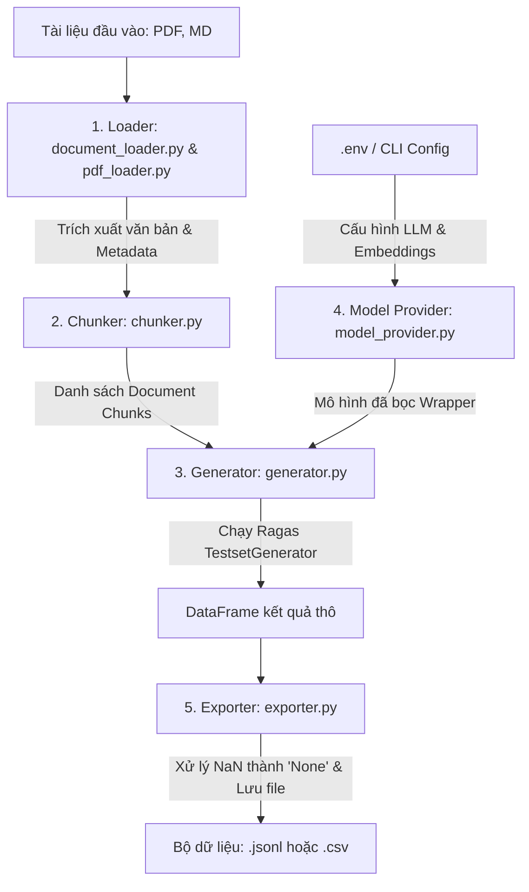

# RAG Evaluation Dataset Generation Pipeline

Tài liệu này mô tả chi tiết cách thức hoạt động của luồng xử lý (pipeline) trong mã nguồn **FISAT-2026** để tạo bộ dữ liệu đánh giá (RAG Evaluation Dataset) từ các tài liệu gốc (PDF, Markdown).

---

## 📌 Tổng Quan Luồng Hoạt Động (Architecture Flow)

Dưới đây là sơ đồ luồng dữ liệu đi qua các thành phần của hệ thống từ đầu vào đến đầu ra:



---

## 🏃 Các Bước Chạy Pipeline (Execution Steps)

Để chạy pipeline sinh dataset, bạn thực hiện qua các bước sau:

### Bước 1: Khởi động mô hình (Backend)
Nếu sử dụng Ollama thông qua Kaggle/Ngrok, hãy chắc chắn rằng dịch vụ Ollama và đường truyền Ngrok đã hoạt động công khai. 

### Bước 2: Thiết lập file cấu hình `.env`
Đảm bảo các biến môi trường được cấu hình chính xác (ví dụ cho Ollama kết nối qua Ngrok):
```env
RAGAS_PROVIDER=ollama
RAGAS_LLM_BASE_URL=https://macaroni-hunting-mutation.ngrok-free.dev
RAGAS_LLM_MODEL=qwen2.5:14b
RAGAS_EMBEDDINGS_BASE_URL=https://macaroni-hunting-mutation.ngrok-free.dev
RAGAS_EMBEDDINGS_MODEL=nomic-embed-text
RAGAS_MAX_WORKERS=2
RAGAS_LANGUAGE=vietnamese
```

### Bước 3: Chạy lệnh CLI Sinh dữ liệu
Chạy lệnh CLI từ thư mục gốc của dự án:
```powershell
python -m src.evaluation_dataset.cli generate `
  --input-dir docs/KB/BachDang `
  --output-path docs/KB/BachDang/rag_eval_dataset.sample.jsonl `
  --output-format jsonl `
  --testset-size 5
```

---

## 🔍 Chi Tiết Từng Thành Phần Trong Pipeline

### 1. Document & PDF Loader (`document_loader.py` & `pdf_loader.py`)
* **Nguồn dữ liệu**: Đọc từ thư mục chỉ định qua `--input-dir` chứa các file `.pdf`, `.md`, `.markdown`.
* **Cơ chế hoạt động**:
  * **Đọc file Markdown**: Đọc nội dung văn bản thô trực tiếp.
  * **Đọc file PDF**: Sử dụng thư viện `fitz` (PyMuPDF) để trích xuất văn bản theo từng trang.
  * **Tối ưu hóa OCR**: Nếu trong cùng một thư mục có cả file `.pdf` và file `.md` trùng tên gốc (ví dụ: `tailieu.pdf` và `tailieu.md` - bản OCR chất lượng cao), hệ thống sẽ **tự động bỏ qua file PDF** và chỉ tải file Markdown để đảm bảo độ chính xác ngữ nghĩa cao nhất.
  * **Kiểm soát chất lượng trích xuất**: Hệ thống tính toán số từ trung bình trên mỗi trang PDF. Nếu phát hiện PDF quét ảnh (scanned) không có text hoặc chất lượng quá thấp (ít hơn 10 từ/trang), hệ thống sẽ chặn sớm và báo lỗi `PdfExtractionQualityError` để tránh làm hỏng dữ liệu đầu vào của Ragas.

### 2. Chunker (`chunker.py`)
* **Nhiệm vụ**: Chia nhỏ văn bản của từng trang/tài liệu thành các phân mảnh nhỏ hơn (Chunks) để LLM có thể xử lý hiệu quả.
* **Cơ chế hoạt động**:
  * Sử dụng bộ chia **`RecursiveCharacterTextSplitter`** của LangChain.
  * Tách đệ quy dựa trên mức độ ưu tiên của các ký tự phân tách: Đoạn văn (`\n\n`) $\rightarrow$ Dòng đơn (`\n`) $\rightarrow$ Câu (`. `) $\rightarrow$ Từ (` `) $\rightarrow$ Ký tự thô (`""`).
  * Kích thước mặc định của mỗi chunk là `1000` ký tự, độ trùng lặp là `150` ký tự (giúp tránh việc mất ngữ cảnh ở biên phân mảnh).
  * **Metadata Binding**: Mỗi chunk được gán các siêu dữ liệu quan trọng như `source_file`, `page_number`, `chunk_index`, và `chunk_id`.

### 3. Model Provider (`model_provider.py`)
* **Nhiệm vụ**: Khởi tạo và đóng gói các đối tượng LLM và Embeddings phù hợp với Ragas từ cấu hình môi trường.
* **Cơ chế hoạt động**:
  * Hỗ trợ 3 nhà cung cấp chính: `openai`, `openai-compatible`, và `ollama`.
  * **Bọc Ragas Wrapper**: Để tương thích với Ragas phiên bản mới (0.4.0+), các đối tượng mô hình của LangChain được tự động bọc qua lớp `LangchainLLMWrapper` và `LangchainEmbeddingsWrapper`.
  * **Định dạng Ollama**: Tự động cấu hình `format="json"` và `temperature=0.0` khi chạy với Ollama nhằm giảm thiểu tỷ lệ lỗi phân tách JSON từ mô hình cục bộ.
  * **System Prompt**: Nếu ngôn ngữ đích là `vietnamese`, hệ thống sẽ tự động gán System Prompt yêu cầu LLM viết câu hỏi và câu trả lời bằng tiếng Việt.

### 4. Generator (`generator.py`)
* **Nhiệm vụ**: Điều phối quy trình sinh tập dữ liệu câu hỏi - câu trả lời từ các chunk dữ liệu.
* **Cơ chế hoạt động**:
  * Sử dụng lớp `TestsetGenerator` của Ragas cùng với 3 bộ sinh câu hỏi khác nhau:
    * `SingleHopSpecificQuerySynthesizer`: Sinh câu hỏi đơn giản, lấy thông tin trực tiếp từ 1 chunk duy nhất.
    * `MultiHopSpecificQuerySynthesizer`: Sinh câu hỏi phức tạp hơn, yêu cầu tổng hợp thông tin từ nhiều chunk khác nhau.
    * `MultiHopAbstractQuerySynthesizer`: Sinh câu hỏi mang tính khái quát, suy luận từ nhiều chunk.
  * **Overlap & NER**: Hệ thống xây dựng pipeline chuyển đổi node mặc định (Node Transform). Trong đó, `OverlapScoreBuilder` kết hợp với thư viện `rapidfuzz` để đo khoảng cách chuỗi thực thể (Named Entities) giữa các chunk nhằm tạo mối liên kết ngữ nghĩa giữa chúng.
  * **Đồng bộ hóa tiếng Việt**: Để khắc phục hiện tượng mô hình trả về tiếng Việt không dấu hoặc sai chính tả, hệ thống sẽ chèn thêm chỉ thị định dạng khắt khe vào prompt sinh:
    > "Always write the query ('query') and answer ('answer') in proper, fully-signed Vietnamese (tiếng Việt có dấu đầy đủ, đúng chính tả, không viết không dấu hoặc thiếu dấu)."

### 5. Exporter (`exporter.py`)
* **Nhiệm vụ**: Xuất dữ liệu đã sinh ra các định dạng chuẩn để sử dụng cho việc huấn luyện hoặc đánh giá RAG.
* **Cơ chế hoạt động**:
  * Chuyển đổi cấu trúc tập dữ liệu Ragas sang định dạng `pandas.DataFrame`.
  * **Xử lý tương thích Kaggle**: Các cột metadata bổ sung như `Persona name`, `Query style`, `Query length` thường bị trống (null) ở các câu hỏi phức tạp (Multi-hop). Kaggle không chấp nhận các giá trị trống này khi import. Do đó, hàm `export_dataset` sẽ tự động chuyển toàn bộ các giá trị trống thành chuỗi chữ `"None"`.
  * Lưu file dưới định dạng `.jsonl` (JSON Lines) hoặc `.csv` tùy cấu hình.
